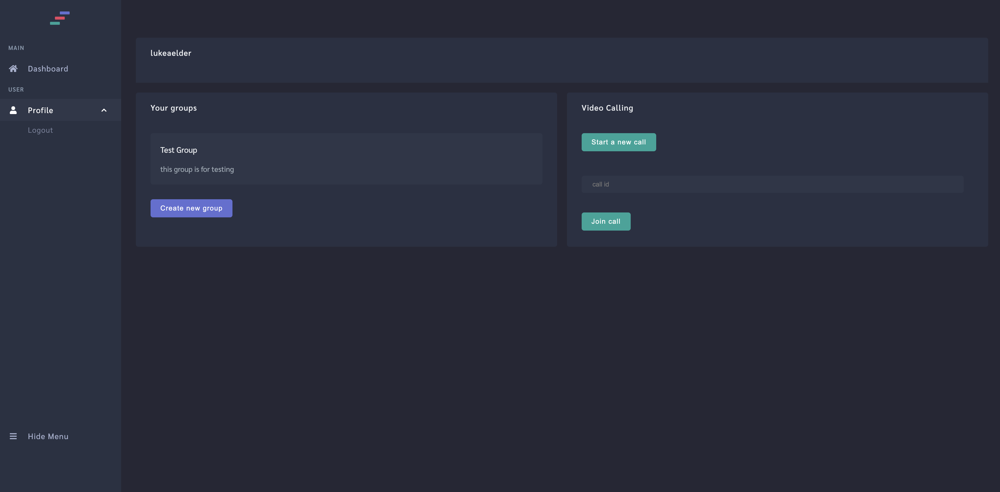

# Group Scheduling App

<table text-align="center">
    <tr>
        <td></td>
        <td></td>
    </tr>
    <tr>
        <td></td>
        <td></td>
    </tr>
</table>

Live Demo [c2-scheduler](https://c2-scheduler.surge.sh)

---

## About the project

This project was created as the 2nd capstone for the [Springboard](https://www.springboard.com/) software engineering course. With a focus on learning new technoogies like web sockets and creating a fully responsive app.

User features:
* Creation and logging into accounts
* Creation of groups
    * Add users to groups
    * Add todos to groups
    * Show group todo progress
    * Add announcements to groups
    * live group chat
* Live 1 on 1 video calling

---

## Technologies used

* HTML
* CSS
* Javascript
* [Axios](https://www.npmjs.com/package/axios)
* [Postgres](https://www.postgresql.org/)
* [Font Awesome](https://fontawesome.com/)
* [ReactJS](https://reactjs.org)
* [Node](https://nodejs.org)
* [Express](https://expressjs.com)
* [Bcrypt](https://www.npmjs.com/package/bcrypt)
* [Uuid](https://www.npmjs.com/package/uuid)
* [Shortid](https://www.npmjs.com/package/shortid)
* [Jsonwebtoken](https://jwt.io)
* [Socket.io](https://socket.io)
    * Used for chat rooms and video call rooms
* [WebRTC](https://webrtc.org)
    * [WebRTC](https://webrtc.org) uses [Simple-peer](https://github.com/feross/simple-peer) to create connection id's of users which get sent to the [Socket.io](https://socket.io) connection, storing their id's in a room and connecting the 2 users to broadcast data between them creating a video call
* [Simple-peer](https://github.com/feross/simple-peer)

---

## Run a local version

1. Clone or download the repo.
 ```sh
git clone https://github.com/lukeaelder/Capstone2.git
```
2. Install the packages.
```sh
cd frontend
npm i
```
```sh
cd backend
npm i
```
3. Create a database using [Postgres](https://www.postgresql.org/).
```sh
createdb scheduler
```
4. Create tables in database located in database.sql file.
5. Start frontend and backend servers. Frontend will be running on [localhost:3000](http://localhost:3000). Backend will be running on [localhost:5000](http://localhost:5000)
```sh
cd frontend
npm start
```
```sh
cd backend
node server.js
```